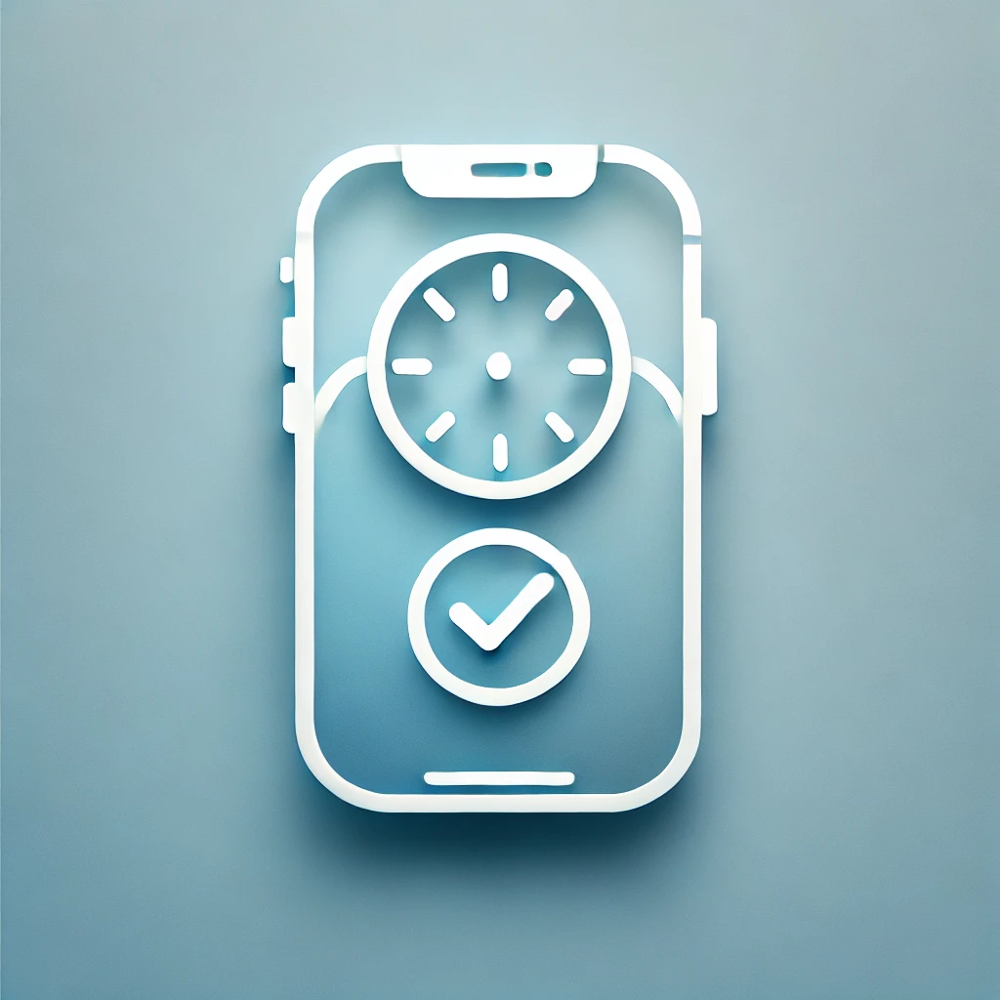
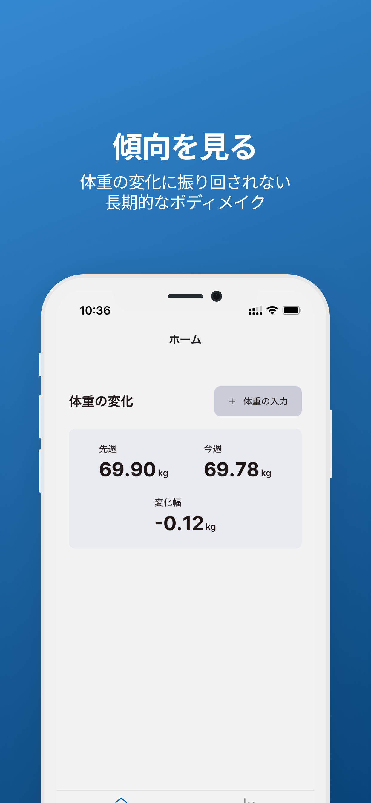
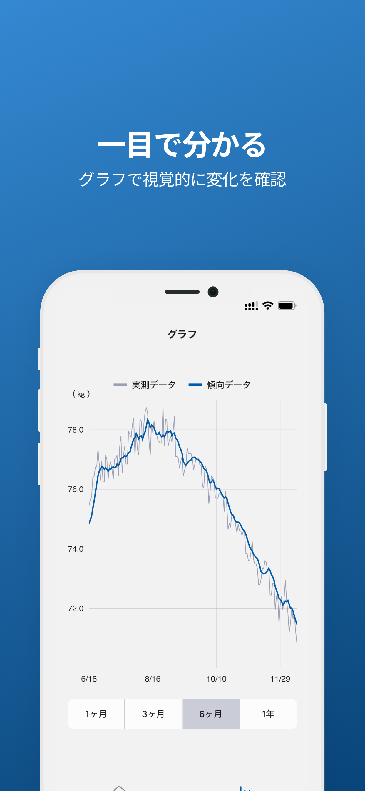
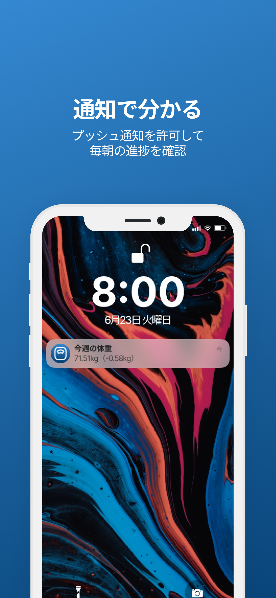

    
    <h1>からチェキ / Karacheki</h1>

からチェキはボディメイクの正しい考え方と習慣を身につけるボディメイクサポートアプリです。体重の変化に一喜一憂せずに長期的に無理のない目標達成をサポートします。

    
    
    

## 🌐 Installation

## 📝 Release Article

[ボディメイクを成功させるアプリをリリースしました - Zenn](https://zenn.dev/h_yokoyama/articles/karacheki-release)

## 📍 Features/Roadmap

未チェック項目は実装予定です。

### 全体

* [x] iOSはAppleヘルスケアから体重データを取得
* [x] 体重の週平均と変化幅をPush通知でお知らせ
* [ ] Androidのリリース
* [ ] AndroidはGoogle Fitから体重データを取得

### ホーム画面

* [x] 体重の週平均と先週の週平均の変化を計算・表示
* [x] 体重の手動記録
* [x] Push通知の受け取り設定
* [ ] Push通知の頻度・時間設定

### グラフ画面

- [x] 体重の実測データと傾向データを折れ線グラフで表示
- [x] グラフの表示期間幅（スケール）を1ヶ月~1年で切り替え
- [ ] スケールを変えずに、グラフを横スライドして表示期間を変える

### Before/After画面

- [ ] Before/After画像を撮影してトリミングできる
- [ ] 画像を端末もしくはアプリ内に保存する（アプリ内設定）
- [ ] 2枚を選択して、Before/Afterを比較できるようにする
- [ ] 画像と測定データを紐づけて、比較できる

## 🧰 Tech Stack

* TypeScript
* React Native
* Expo
* Tamagui
